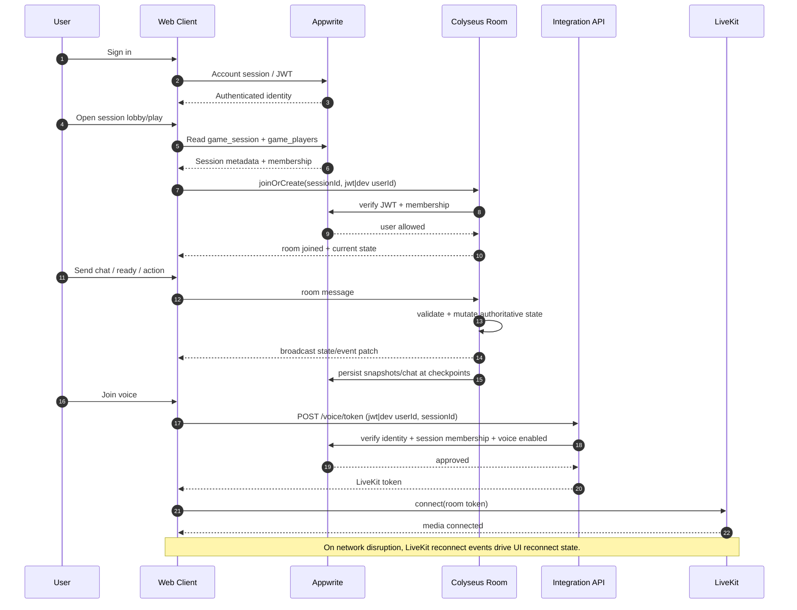

# Session Play Sequence

This document captures the high-level sequence when a player joins and plays in a live session.

## Join and play flow

## Validation checkpoints

- Auth validation: Appwrite account identity via JWT (or dev user fallback in development mode).
- Membership validation: game player membership must exist and not be `left`/`kicked`.
- Voice gating: session must have `voiceChatEnabled` before token issuance.
- Runtime authority: Colyseus remains source of truth for active session mutation.

## Failure modes and expected behavior

- Invalid session join auth: room join rejected.
- Duplicate join attempts: existing membership reused or reactivated when previously left.
- Session capacity exceeded: join request rejected in web join flow.
- Voice permission denied: user receives explicit microphone-permission error.
- Voice transport interruption: UI surfaces reconnecting status and recovers on `Reconnected`.
