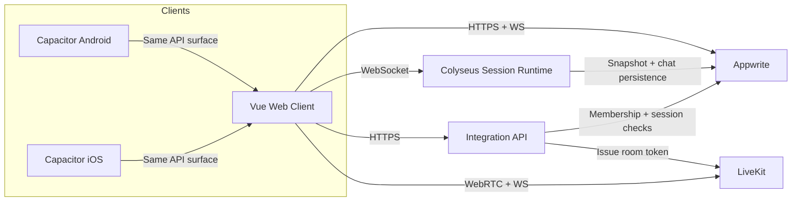

# System Context

This document describes DDP service boundaries and runtime responsibilities.

## Boundary summary

- `apps/web`: user interface, auth-driven routing, local UI orchestration.
- `apps/colyseus-server`: authoritative live session runtime and command handling.
- `apps/integration-api`: trusted backend glue (currently voice token issuance).
- `Appwrite`: authentication, persistence, document permissions, storage.
- `LiveKit`: optional voice transport and realtime media state.

## Component context diagram

## Service ownership map

### Appwrite owns

- user identity and account sessions
- persistent documents (`characters`, `campaigns`, `game_sessions`, `game_players`, `text_messages`, `session_snapshots`, `rules_profiles`)
- storage (including profile avatar uploads)
- permission-scoped data access

### Colyseus owns

- authoritative in-memory session state
- room membership enforcement for active sessions
- command validation and runtime mutation
- session lifecycle transitions (`lobby`, `active`, `paused`, `ended`)

### Integration API owns

- trusted token issuance for voice
- backend-only checks prior to media access

### LiveKit owns

- voice room connectivity and media transport
- reconnect behavior for voice sessions
- active speaker events

## Current known gaps

- Appwrite permission hardening still in progress for strict member-only document access semantics across all collections.
- Integration API endpoint catalog is intentionally thin and should stay explicit to avoid service creep.
